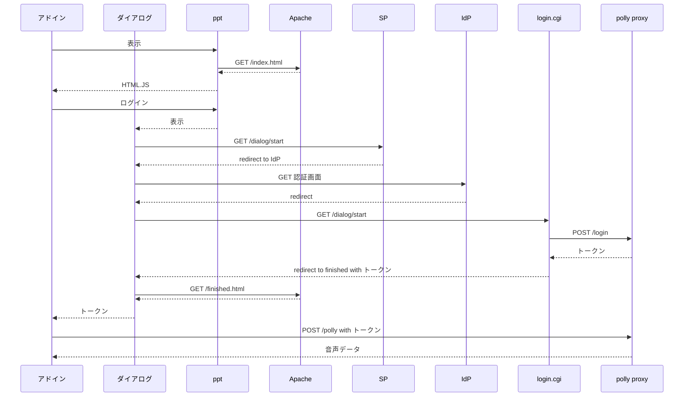

# アクセス制限機能

## 概要

アクセス制限機能は、中継サーバ(server)の設定で有効にすることができ、別途設置した学認SP と合わせて、確認用アドインとWASM版Webアプリのユーザに対して、以下の機能を実現します。

- 学認SSO でユーザを認証する
  - 学認アカウントを持ったユーザは Amazon Polly を使うことができる

- アクセス制限
  - 課金期間毎の使用量に制限をかけることができる

- ログ
  - 使用量ログをファイルに記録する
  - 中継サーバ(server) へのアクセスログを記録する

- UI
  - ログインボタンによって学認SSOにログインできる

## 学認SSO でユーザを認証する

以下の方法で、学認SP によるユーザ認証を行います。

- 既存のアプリケーションのユーザ管理へのProxy（代行システム）を用意する
- https://meatwiki.nii.ac.jp/confluence/pages/viewpage.action?pageId=12158288
- SPでログインページを保護する
- ログインボタンでログインページを表示する
- アドイン、ダイアログ、WASM版Webアプリ、学認SSO を同一ドメインとする

学認による認証が行われたユーザに対してトークンを発行します。

- 中継サーバ(server) が JWT形式のトークンを発行
- トークンに含まれる 16進数 10桁の id はランダムに生成する
- トークンの有効期限は 7日間とする
- 秘密鍵で署名する
- 署名に使う秘密鍵は中継サーバ(server)だけが知っている

## アクセス制限

以下のように、音声合成リクエストの利用を制限します。

- 有効なトークンが提示されないリクエストはエラーとする
- 署名及び有効期限をチェックする
- 使用量による制限
  - 課金期間中にあらかじめ指定した制限使用量を超えた場合、サービスを停止する
  - サービス停止中はリクエストをエラーとする
  - アドイン側でサービス停止中と表示する

## ログ

### 使用量ログ

アクセス制限機能が有効なとき、使用量ログが記録されます。

サーバはAWSの課金期間に対応した UTC基準の月毎のファイルで、課金期間の使用量を管理します。サーバはカレントディレクトリに log/yyyymm.log という形式のファイル名でファイルを作成します。

ファイルの内容は JSON形式で、total は該当月に音声変換した文字数の総計、usage は日毎の文字数を表しています。

```
<<例>>

{"total":0,"usage":[0,0,0,0,0,0,0,0,0,0,0,0,0,0,0,0,0,0,0,0,0,0,0,0,0,0,0,0,0,0,0]}
```

### アクセスログ

サーバは以下の内容のアクセスログをログファイルに記録します。

- 時刻 (ISO 8601 形式, 日本標準時)
- リクエスト元IPアドレス (IPv4, IPv6 のどちらか)
- リバースプロキシー使用時の転送元IPアドレス
- HTTPメソッド (GET, POST など)
- URL Path
- HTTPステータス (200, 400 など)
- 本システムで生成したid
- username、リクエスト文字数、エラーメッセージなど

トークン発行時はログインCGIが提示した username と生成した id を記録します。

```
::1 - POST /login 200 b77267b5d3 username
```

音声合成リクエスト時は、id,リクエスト文字数,音声データサイズを記録します。

```
::1 - POST /polly 200 b77267b5d3 11 20342
```

WASM版Webアプリのユーザ操作は、以下の形式で記録します。

```
::1 - POST /app/log 200 b77267b5d3 <タイプ> <パラメータ>
```

| タイプ         | パラメータ                  | 記録タイミング     |
|----------------|-----------------------------|--------------------|
| open-directory |                             | ディレクトリを選択 |
| open-pptx      | filename, size, numslides   | ビデオの作成へ     |
| output-video   | filename, numtopics         | ビデオを出力する   |
| save-video     | filename, size, duration    | ビデオを保存する   |

## 確認用アドイン UI

認証成功時、ダイアログに finished.html が表示されたタイミングで、アドインにトークンを送信します。ユーザは[閉じる]ボタンか、右上の x でウィンドウを閉じることができます。

アドインは、中継サーバ(server)へのアクセスにともなう HTTP ステータスによって、以下のようなメッセージを表示します。ログインが必要なときは、音声合成ボタンを押すことができません。

| HTTPステータス               | 意味           | メッセージ |
| ---------------------------- | -------------- | --------------------------- |
| 200                          | 成功           | なし |
| 401                          | 認証失敗       | ログインしてください |
| 400                          | POLLYエラー    | |
|  InvalidSsmlException        |                | SSMLの書式が不正です |
|  TextLengthExceededException |                | 文字列が長すぎます |
|  それ以外                    |                | システムエラーが発生しました|
| 503                          | 当月使用量超過 | サービスが停止中です |
| それ以外                     |                | 不明なエラーが発生しました |

アドインは localStorage にトークンを保存し、起動時に保存済みのトークンが有効かどうか確認します。トークンが無効な場合、アドインは[ログイン]ボタンを表示します。

polly proxy は 7日間有効なトークンを発行します。polly proxy 側の署名鍵を変更して再起動することで、発行済トークンを無効化できます。

## 設定

設定のデフォルト値は server/config.js ファイルで定義しています。設定を変更する場合は、以下の環境変数に値を設定します。

| 内容            | 単位       | デフォルト | 環境変数 |
| --------------- | ---------- | ---------- | -------- |
| authorization   | true/false | false      | POLLY_AUTHORIZATION |
| logdir          | 文字列     | log        | POLLY_LOGDIR |
| usage limit     | 文字数     | 1000000    | POLLY_USAGE_LIMIT |
| check interval  | 時間(秒)   | 10秒       | POLLY_CHECK_INTERVAL |
| update interval | 時間(秒)   | 600秒      | POLLY_UPDATE_INTERVAL |
| httplogdir      | 文字列     | httplog    | POLLY_HTTPLOGDIR |

環境変数 POLY_AUTHORIZATION が true のとき、アクセス制限機能が有効になります。デフォルトでは無効です。

使用量ログを記録するディレクトリは、環境変数 POLY_LOGDIR で設定します。

リクエストを実行した結果、月毎の使用量が usage limit を超えると、その月の間はサービスを停止します。月が変わるとサービスは自動的に回復します。

使用量ログファイルは update interval 間隔で更新します。日替わり、月替り処理やログファイルの更新を行うべきかどうかは、check interval 間隔で確認します。

使用量ログファイルは、logdir で指定したディレクトリに作成します。

アクセスログを記録するディレクトリは、環境変数 POLLY_HTTPLOGDIR で設定します。

## 実装の詳細

Webサーバは単一ドメインとし、次のようにパスを構成します。

- /polly, /login は polly proxy が処理する
- HTML, JS ファイルは、Apache または polly proxy が配布する
- /dialog/start を学認SPでガードする

/dialog/start ページは学認SP でガードし、認証なしではアクセスできないようにします。

sample-login は開発用プログラムで、SP + login.cgi に相当する働きをするサーバです。このプログラムはユーザ名/パスワードを受け取りますが、その内容はチェックしないので、本番運用には使用できません。

トークン取得シーケンスは、以下のとおりです。


